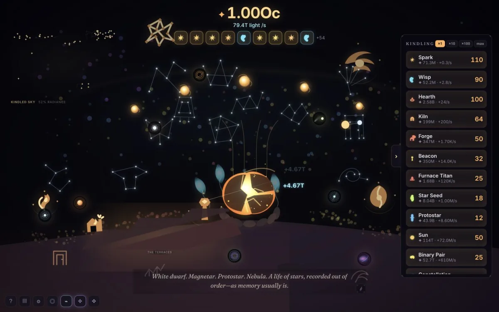
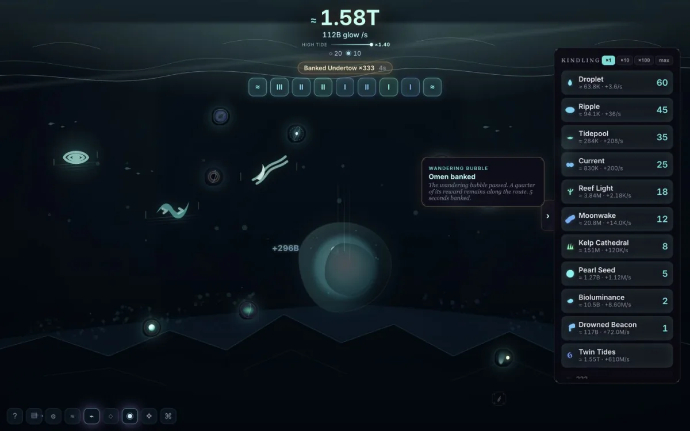
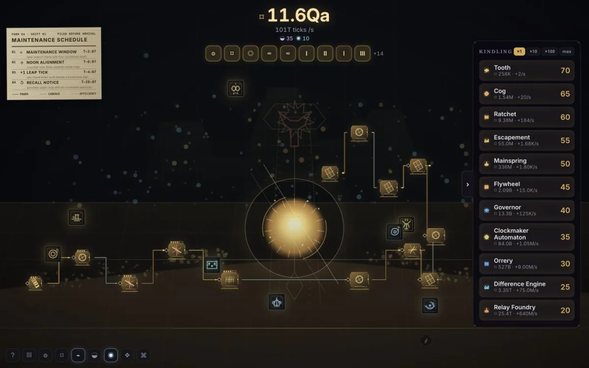
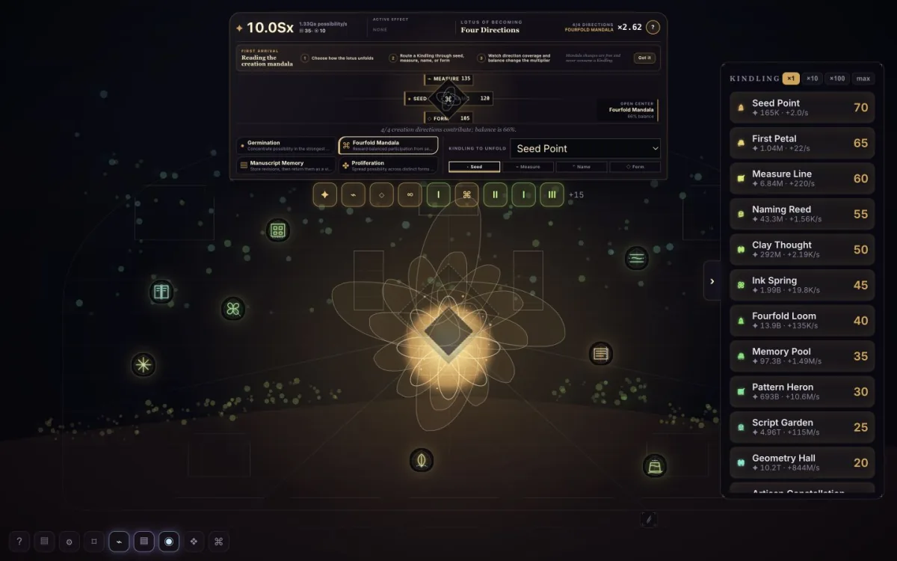
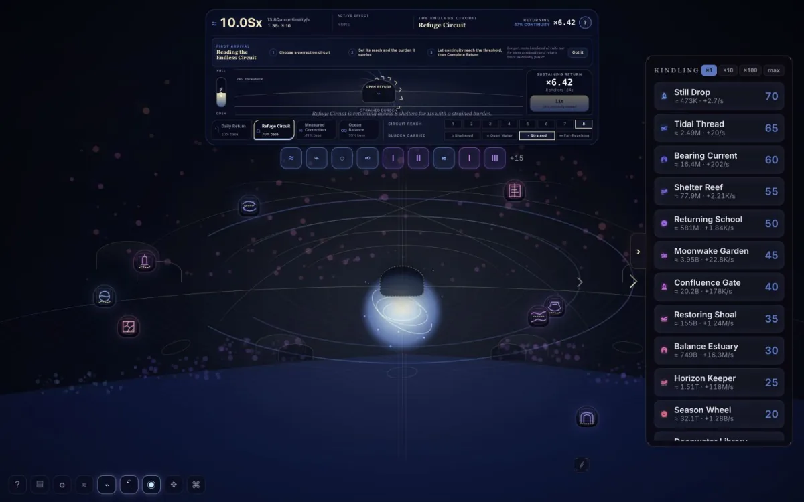
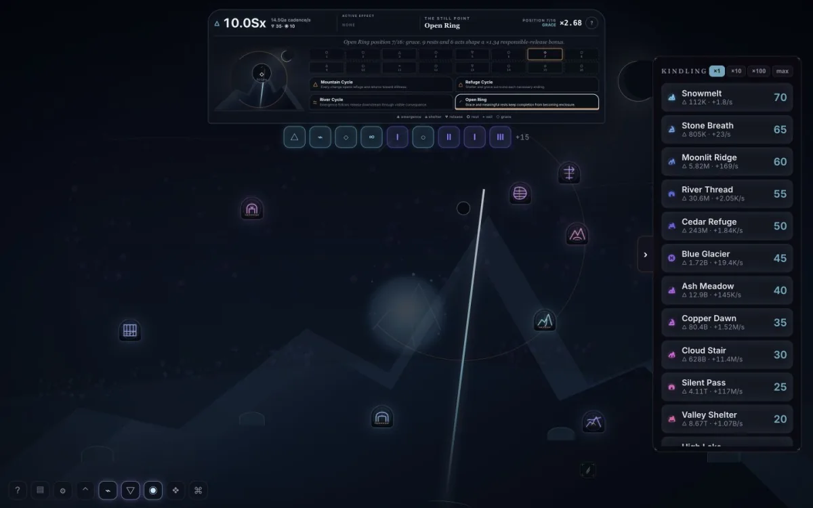

# ✦ EMBER

> A story-driven incremental game about rebuilding a dead universe—and deciding what the next one should become.



The universe is dark. One ember remains.

Begin with a single touch, gather light, and kindle the first structures in an empty sky. As the world grows, the game itself awakens around it: the shop, records, music, archives, prestige systems, and eventually the routes to other universes. Lumen, a quiet archivist with an incomplete account of the past, remembers more with every cycle.

EMBER is a desktop-first browser game for players who enjoy incremental progression, atmospheric world-building, unusual interfaces, and stories that unfold through play.

## What awaits

- **Seven authored realms.** Emberlight, Tidefall, Verdance, Clockwork, Brahmalok, Vishnulok, and Kailash each have their own economy, visual language, soundscape, active system, Archive, trials, story, and ending ritual.
- **A world that visibly grows.** Every Kindling purchase changes the playfield through new objects, settlements, routes, machines, currents, gardens, and celestial structures.
- **More than bigger numbers.** Shape tides, age living cohorts, route a civic machine, unfold a creation mandala, carry a sustaining current, and arrange responsible release around a still point.
- **Layered progression.** Local Epoch Turns, the Deep, Vessels, universe crossings, Succession Relays, the Chronicle, deterministic Atlas routes, and the Garden keep completed worlds meaningful.
- **A complete narrative arc.** Recover Echoes, learn what ended the former universe, answer Lumen's question, and carry that answer into the worlds that follow.
- **Player-respecting design.** No ads, gacha, energy timers, paid boosts, expiring rewards, or punishment for missing an event.

## The worlds

| Realm | What makes it different |
|---|---|
| **Emberlight** | Rebuild warmth, settlement, and a sky of remembered constellations. |
| **Tidefall** | Raise light through a moonless ocean whose living tide changes production. |
| **Verdance** | Grow cohorts that age, graft, remember, and renew instead of merely multiplying. |
| **Clockwork** | Route deterministic power through a civic machine governed by maintenance schedules. |
| **Brahmalok** | Unfold possibility through seed, measure, name, form, and a four-direction creation mandala. |
| **Vishnulok** | Sustain continuity through refuge, correction, return, and a calm cosmic ocean. |
| **Kailash** | Approach dissolution as responsible release, with shelter, grace, stillness, and renewal kept visible. |

## In-game gallery

<table>
  <tr>
    <td width="50%">
      <a href="docs/screenshots/tidefall.webp"></a><br>
      <sub><b>Tidefall</b> — a living ocean with fair, catchable Omens and a changing tide.</sub>
    </td>
    <td width="50%">
      <a href="docs/screenshots/clockwork.webp"></a><br>
      <sub><b>Clockwork</b> — a deterministic city-machine with visible power routing.</sub>
    </td>
  </tr>
</table>

### The three lokas

<table>
  <tr>
    <td width="33%">
      <a href="docs/screenshots/brahmalok.webp"></a><br>
      <sub><b>Brahmalok</b> — creation without enclosing every possibility.</sub>
    </td>
    <td width="33%">
      <a href="docs/screenshots/vishnulok.webp"></a><br>
      <sub><b>Vishnulok</b> — preservation through responsive correction and return.</sub>
    </td>
    <td width="33%">
      <a href="docs/screenshots/kailash.webp"></a><br>
      <sub><b>Kailash</b> — release that keeps refuge and renewal in view.</sub>
    </td>
  </tr>
</table>

## Play locally

EMBER currently runs from source. Install a current version of [Node.js](https://nodejs.org/) and npm, then:

```bash
git clone https://github.com/harsit14/ClickSim.git
cd ClickSim
npm install
npm run dev
```

Open the local address printed by Vite, usually `http://localhost:5173`.

The game autosaves in the browser and supports offline progress, exportable save codes, downloadable backups, import validation, and recovery checkpoints. It is best experienced on desktop with sound, but every mechanic remains playable while muted and with reduced motion.

## Controls

| Input | Action |
|---|---|
| Click, <kbd>Space</kbd>, or <kbd>Enter</kbd> | Activate the Heart |
| <kbd>1</kbd>–<kbd>9</kbd> | Buy a visible Kindling |
| <kbd>B</kbd> | Cycle the bulk-purchase amount |
| <kbd>G</kbd> | Open the Field Guide |
| <kbd>I</kbd> | Open run records |
| <kbd>O</kbd> | Open options |
| <kbd>C</kbd> | Open the current world's Archive |
| <kbd>V</kbd> | Open the Vessel |
| <kbd>S</kbd> | Open the local Epoch system |
| <kbd>D</kbd> | Enter the Deep |
| <kbd>E</kbd> | Open the Story Archive |
| <kbd>L</kbd> | Open the Legacy hub |
| <kbd>Escape</kbd> | Close the active panel |

Controls appear only after their systems awaken. The options menu includes reduced motion, large text, high contrast, beat-guide strength, render quality, audio controls, and alternative number formats.

## Project status

The complete seven-realm route is playable in development, including its endings and continuing Atlas. EMBER is still being refined for a formal public release.

Brahmalok, Vishnulok, and Kailash use environment-first art and original game fiction; deities are not currencies, opponents, collectibles, or upgrade buttons. External Hindu cultural consultation and South Asian art/iconography review remain required before release.

## For developers

```bash
npm run verify   # TypeScript, tests, content proofing, production build, budgets, and offline audit
npm run build    # Static production build in dist/
npm run preview  # Preview the production build
```

The game is built with Svelte 5, TypeScript, Canvas 2D, and the Web Audio API. Music and sound effects are synthesized at runtime; no prerecorded audio files are shipped.
