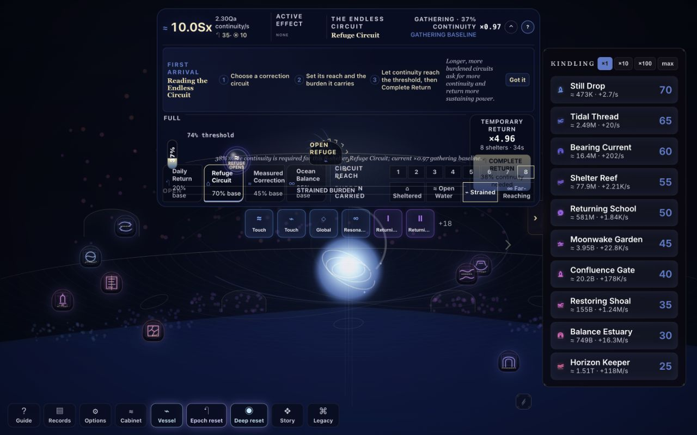
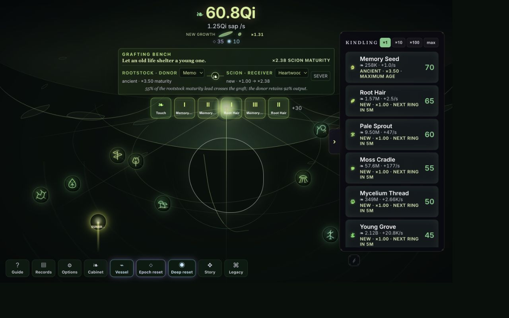
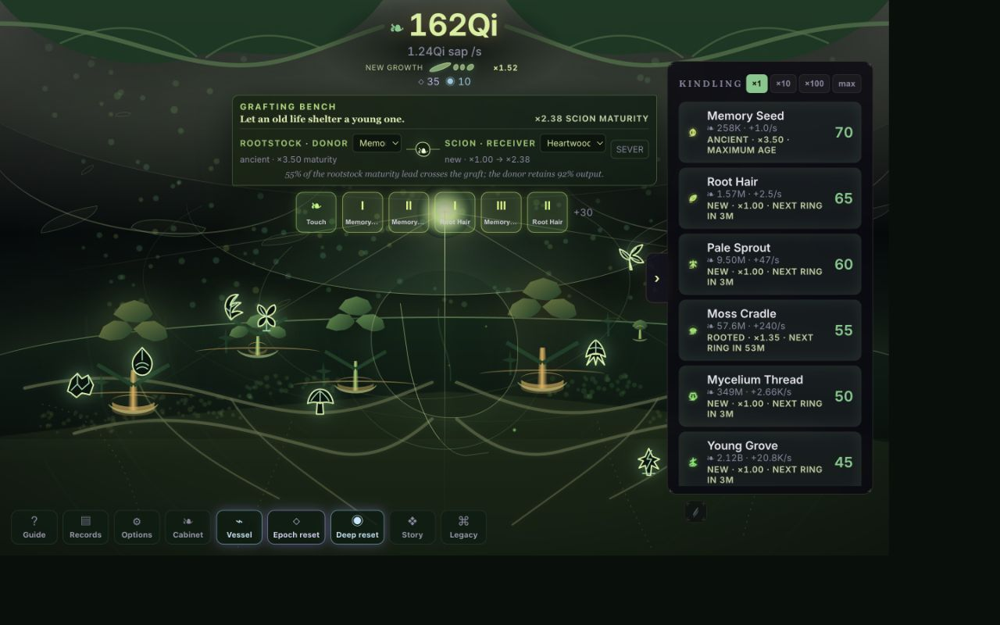
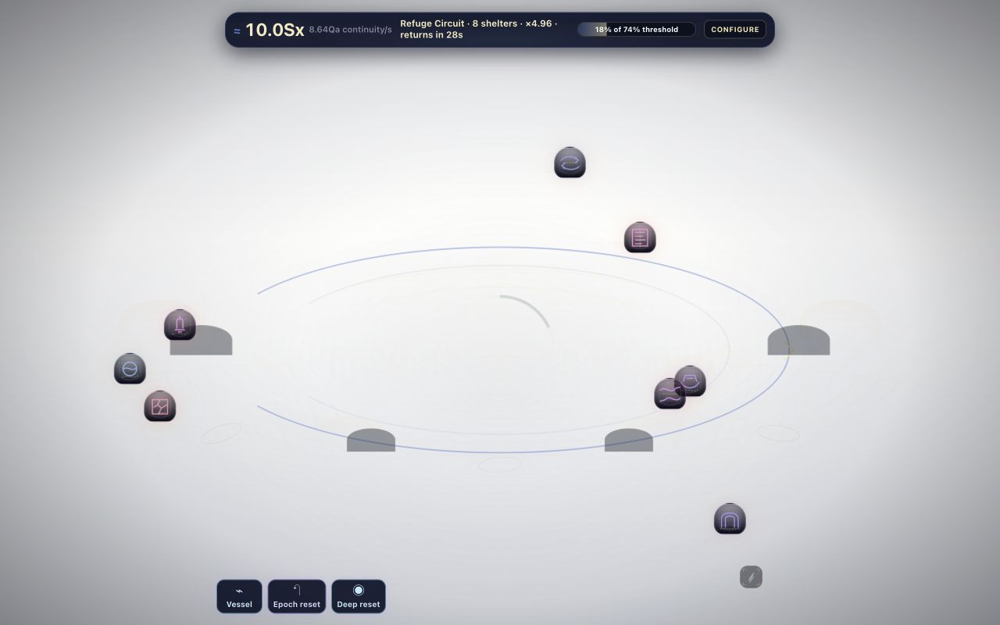
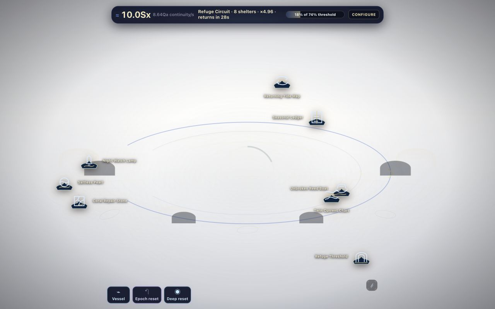
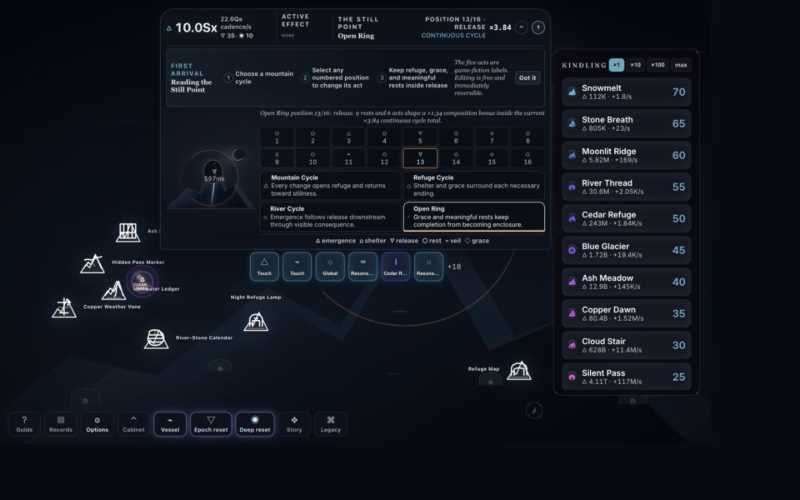
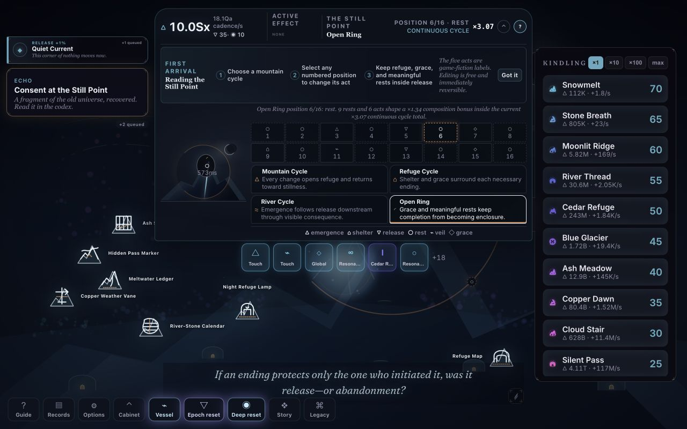
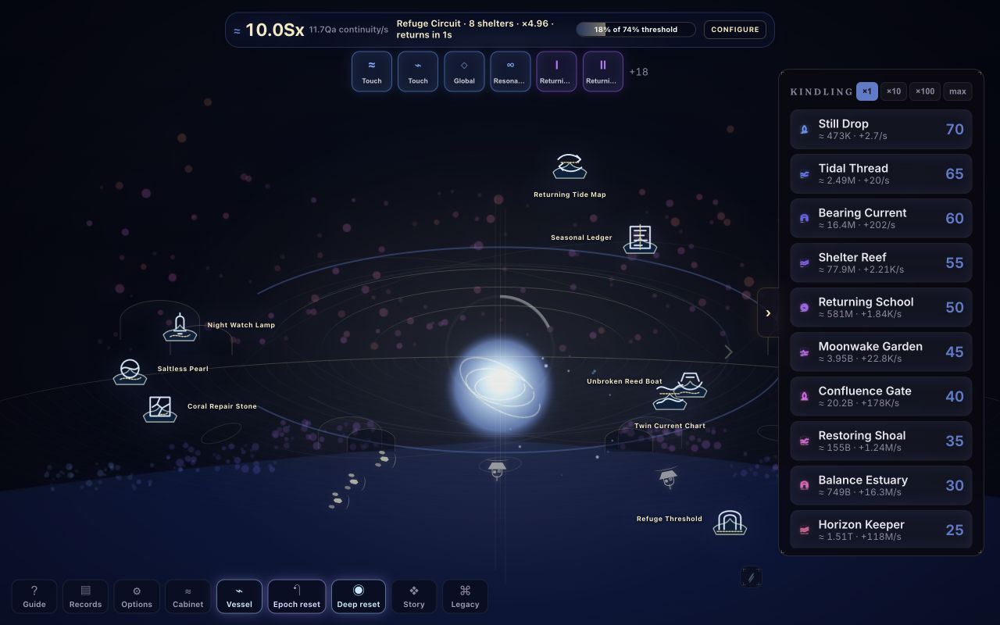
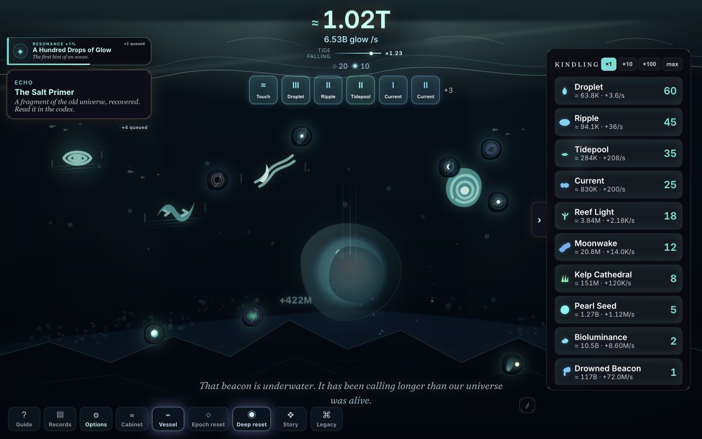
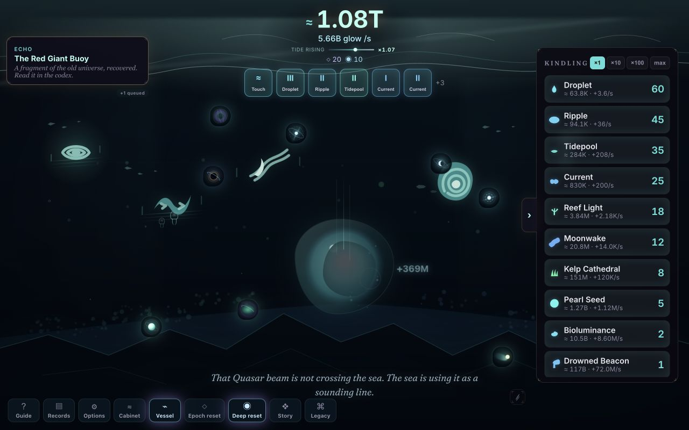

# EMBER UI improvement pass

## Result

All six presentation phases shipped as independent commits. No economy values, balance rules, mechanic outcomes, or content meaning changed. Every phase was exercised in the running game with deterministic scenarios and the Dev Playtest Panel, captured at 1440×900 and 1280×800 in default and large-text + high-contrast + reduced-motion modes, passed `npm run verify`, and was committed before the next phase began.

| Phase | Commit | Delivered |
| --- | --- | --- |
| 1 | `2de0197` | Settled/configure Loka instruments, flow-based circuit microcopy, and one central queued notification lane. |
| 2 | `60fe37c` | Verdance root network, canopy frame, botanical landmarks, and visible new/rooted/mature/ancient cohort growth. |
| 3 | `8f56de7` | Forty-eight raw world-material Archive silhouettes across Verdance, Brahmalok, Vishnulok, and Kailash. |
| 4 | `0d25b5f` | Kailash snow, pass lights, and one low-salience wind-carried line with a static reduced-motion state. |
| 5 | `309ede0` | Vishnulok schools and shelter craft travelling its orbital circuits with ownership-threshold forms and capped density. |
| 6 | `4f4eb80` | Tidefall owned migrations in the middle band, with the trench floor and its negative space left intact. |

The Phase 3 no-naked-primitives inventory and per-object card answers are recorded in [PHASE3_OBJECT_CARDS.md](PHASE3_OBJECT_CARDS.md).

## Before and after

The pairs below use the most stressful 1280×800 profile where that best exposes the change.

### Phase 1 — Vishnulok instrument and notification ownership

| Before | After |
| --- | --- |
|  |  |

The settled strip now answers circuit, reach, return multiplier, and time-to-return without exposing configuration controls. The five-notification storm remains in the reserved left lane; see [the forced-storm capture](phase1-after-toast-storm-large-high-reduced-1280x800.png). Brahmalok and Kailash received the same compact-state discipline check.

### Phase 2 — Verdance authored depth and age

| Before | After |
| --- | --- |
|  |  |

The ground line now has a root system, the upper field has a canopy frame, and each capped grove seat changes height, rings, branching density, and crown form with its real cohort stage.

### Phase 3 — world-material Archive objects

| Before | After |
| --- | --- |
|  |  |

The full 48-object, flat-black 32px gate is in [the silhouette contact sheet](phase3-silhouette-gate-1440x900.png). Hit areas and accessible names were preserved.

### Phase 4 — Kailash quiet detail

| Before | After |
| --- | --- |
|  |  |

Ambient additions remain subordinate to the Heart and Still Point. Reduced motion freezes the wind and snow into a composed static field.

### Phase 5 — visible continuity in Vishnulok

| Before | After |
| --- | --- |
|  |  |

Traffic is capped at five travellers at high quality and three at low quality. The 1/10/25/50/100 thresholds change each traveller's structure rather than spawning unbounded copies. Reduced motion places the same forms at fixed authored points.

### Phase 6 — Tidefall middle band

| Before | After |
| --- | --- |
|  |  |

Owned Ripple, Reef Light, Kelp Cathedral, and Shoal Constellation states can contribute at most four drifting forms. All migration seats stay between 40% and 59% screen depth; nothing enters the trench band at 62% and below.

## Final accessibility matrix

Verdance and Vishnulok were recaptured across all eight combinations at both viewports:

| Text | Contrast | Motion |
| --- | --- | --- |
| Standard | Normal | System |
| Large | Normal | System |
| Standard | High | System |
| Large | High | System |
| Standard | Normal | Reduced |
| Large | Normal | Reduced |
| Standard | High | Reduced |
| Large | High | Reduced |

That produces 16 final screenshots per universe. Representative maximum-stress captures: [Verdance 1280×800](final-verdance-large-high-reduced-1280x800.png), [Verdance 1440×900](final-verdance-large-high-reduced-1440x900.png), [Vishnulok 1280×800](final-vishnulok-large-high-reduced-1280x800.png), and [Vishnulok 1440×900](final-vishnulok-large-high-reduced-1440x900.png).

## Endgame gallery

Every universe has a settled default-mode 1440×900 capture after applying **All Kindlings + Upgrades** and **Complete Current World**, closing the playtest panel, and allowing the presentation to settle:

- [Emberlight](../../screenshots/endgame/emberlight.png)
- [Tidefall](../../screenshots/endgame/tidefall.png)
- [Verdance](../../screenshots/endgame/verdance.png)
- [Clockwork](../../screenshots/endgame/clockwork.png)
- [Brahmalok](../../screenshots/endgame/brahmalok.png)
- [Vishnulok](../../screenshots/endgame/vishnulok.png)
- [Kailash](../../screenshots/endgame/kailash.png)

## Verification

- `npm run verify` was green after each phase.
- The Phase 6 gate completed 481 tests, content proofread, production build, 2,767.9 KiB / 3,072 KiB initial-payload budget, and offline/static validation.
- Phase 1's forced five-notification storm never entered the HUD or open-panel control region.
- Phase 5 live checks found five capped travellers in default motion and the same five static authored forms under reduced motion.
- Phase 6 live checks found three scenario-owned middle-band migrations in default motion and the same three static forms under reduced motion.
- All final screenshot filenames were dimension-audited against their 1280×800 or 1440×900 labels.
